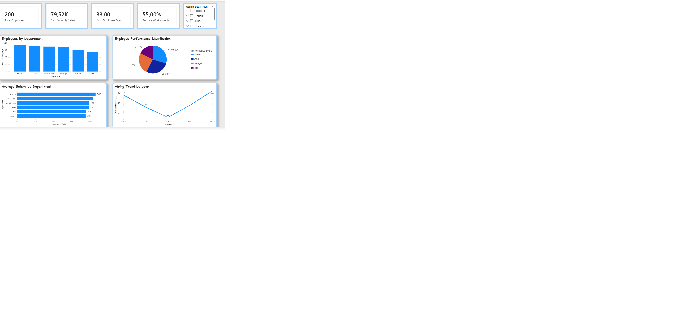

# HR Analytics Dashboard (Power BI)
This project presents an interactive HR Analytics Dashboard built using Power BI to analyze employee data related to performance, compensation, remote work trends and hiring patterns. The dataset is a synthetic HR dataset containing information for 200 employees. It includes demographic, organizational, and performance-related attributes that allow meaningful workforce analysis. This dataset was created for learning and portfolio purposes only and does not represent any real company and individual. 

## Key Fields: 
•	Employee_ID – Unique employee identifier
•	Age – Employee age
•	Department – Department the employee works in (HR, Admin, DevOps, etc.)
•	Region – Employee location
•	Join_Date – Hiring date, 
•	Salary – Monthly salary (USD)
•	Performance_Score – Employee performance rating (Excellent, Good, Average, Poor)
•	Remote_Work – Indicates whether the employee works remotely or in-office.

## Tools Used: 
•	Power BI
•	DAX
•	Data transformation and cleaning in Power Query.

## Key Insights: 
•	55% of employees work remotely. 
•	The Admin department has the highest average salary.
•	Hiring declined in 2022 but increased significantly in 2024. 

## Data Preparation: 
Before building the dashboard, the dataset was cleaned and transformed: converted data types, handled missing values, split and standardized columns, created calculated columns such as Join Year and Work Type, built DAX measures for KPIs such as Remote %.

## Dashboard Preview

